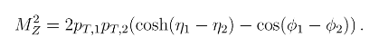

# simple-regressor
Applying machine learning to CERN collision data to estimate the mass of a Z boson

This was a set problem as part of a Machine Learning For Physicists seminar I attended at university.

-------

The actual formula for the invariant mass of a Z-boson resulting from Z -> ee- collisions is know

But for the purposes of this project, the aim was to see if a ML algorithm could independently learn to predict the mass without knowledge of this formula.
The raw data was taken from the CERN website at opendata.web.cern.ch/record/545 , and split into two, 9/10ths of the data going into a training dataset, and the remaining 1/10th being kept hidden from the algorithm for testing purposes

A comparatively deep architecture with 2 hidden layers of 100 nodes, each with ReLu activation functions, feeding into a single output neuron on a linear activation was used.
After iteration and significant feature engineering, the model eventually arrived at a 98.8% accurate predictor aping the "proper" formula nicely.

